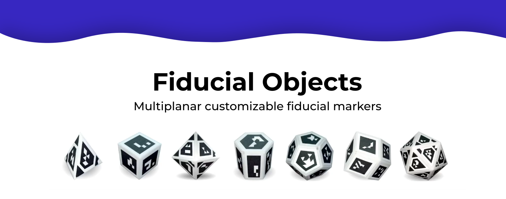

## Overview
🔍 Fiducial Objects are advanced fiducial markers for multiplanar space, offering customizable marker sets for enhanced stability and robustness in camera pose computation. They are effective even with partial marker visibility.


## Abstract
Camera pose estimation is vital in fields like robotics, medical imaging, and augmented reality. Fiducial markers, specifically ArUco and Apriltag, are preferred for their efficiency. However, their accuracy and viewing angle are limited when used as single markers. Custom fiducial objects have been developed to address these limitations by attaching markers to 3D objects, enhancing visibility from multiple viewpoints and improving precision. Existing methods mainly use square markers on non-square object faces, leading to inefficient space use. This paper introduces a novel approach for creating fiducial objects with custom-shaped markers that optimize face coverage, enhancing space utilization and marker detectability at greater distances. Furthermore, we present a technique for the precise configuration estimation of these objects using multiviewpoint images. We provide the research community with our code, tutorials, and an application to facilitate the building and calibration of these objects. Our empirical analysis assesses the effectiveness of various fiducial objects for pose estimation across different conditions, such as noise levels, blur, and scale variations. The results suggest that our customized markers significantly outperform traditional square markers, marking a positive advancement in fiducial marker-based pose estimation methods.

## Tutorials 📚
Step-by-step tutorials to get started:
- [Introduction to Fiducial Objects](https://www.youtube.com/watch?v=YkQfQnKphWk)
- [First Steps with the Fiducial Object Tool](https://www.youtube.com/watch?v=mKcqBrWlq5c)
- [Creating Your First Fiducial Object](https://www.youtube.com/watch?v=R__53asI8Sk)
- [Understanding Marker Generation](https://www.youtube.com/watch?v=atqrqHfE6eE)

## Download 📥
Access the resources for development and research:
- [Download Code from SourceForge](https://sourceforge.net/projects/fiducialobject/). Developed using CPP, OpenCV, CMake and QT Creator. We include a user-friendly GUI Interface.
- [Access Dataset from SourceForge](https://sourceforge.net/projects/fiducialobject-dataset/)

## Citing 📄
If using this library in research, please cite:
```
@article{s23249649,
author = {García-Ruiz, Pablo and Romero-Ramirez, Francisco J. and Muñoz-Salinas, Rafael and Marín-Jiménez, Manuel J. and Medina-Carnicer, Rafael},
title = {Fiducial Objects: Custom Design and Evaluation},
journal = {Sensors},
volume = {23},
year = {2023},
number = {24},
article-number = {9649},
url = {https://www.mdpi.com/1424-8220/23/24/9649},
doi = {10.3390/s23249649}
}
```

## License 📜
Licensed under the [MIT License](https://opensource.org/licenses/MIT).

## Contact 📧
Questions? Contact [pgruiz@uco.es](mailto:pgruiz@uco.es).
Please support my career through my [Github](https://github.com/pabgaru) and [YouTube](https://www.youtube.com/channel/UChmAOYqpthYZoGQ8GW4u2kQ) profiles.

## Related Projects 🔗
- [Marker Mapper](https://www.uco.es/investiga/grupos/ava/portfolio/marker-mapper/)
- [Aruco](https://www.uco.es/investiga/grupos/ava/portfolio/aruco/)

## Getting Started 🚀
For more details, visit the [Fiducial Objects project page](https://www.uco.es/investiga/grupos/ava/portfolio/fiducial-object/).
